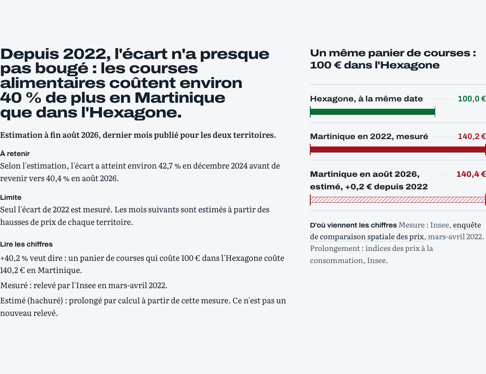
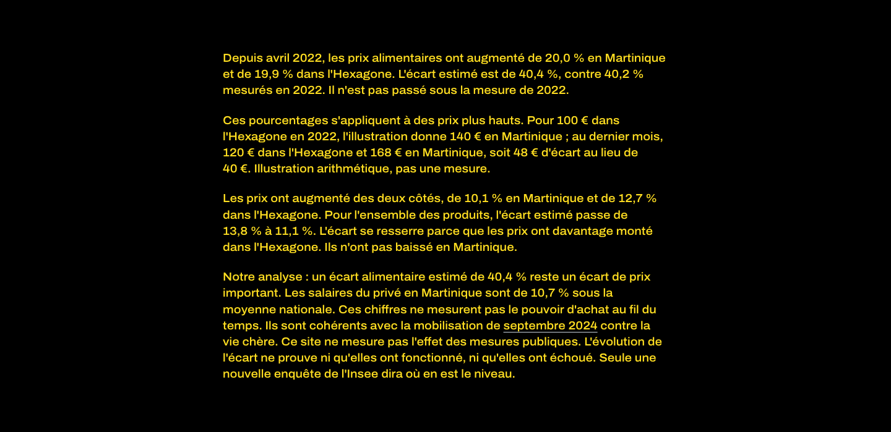

# panyen

> *panyen* — « panier », en créole martiniquais.

En 2022, l'Insee a mesuré que les produits alimentaires coûtaient **40,2 % plus
cher** en Martinique que dans l'Hexagone, et l'ensemble des produits **13,8 %
plus cher**. Ce site répond à la question qui vient juste après, poste par poste
— alimentation, énergie, produits manufacturés, services, et l'ensemble :
**depuis, le différentiel d'évolution des prix se creuse-t-il ou se resserre-t-il ?**

L'écart de niveau de 2022 est une mesure pour l'alimentation (40,2 %) et pour
l'ensemble (13,8 %). Après cette date, ces deux écarts sont des estimations.
Pour l'énergie, les produits manufacturés et les services, seule l'évolution
est comparable.

L'étude est figée au **8 octobre 2026**. Le dernier mois commun aux deux
territoires est **août 2026**. La collecte reste manuelle : ces pages ne se
remettront pas à jour toutes seules.





## Ce que ce projet garantit

- Toute valeur affichée vient d'une source publique identifiée, avec sa date de
  collecte et son identifiant d'origine.
- La collecte et la publication sont manuelles. Il n'y a pas de collecte
  automatique. Une remise à jour attendra un projet d'hébergement cloud.
- Si un test de qualité échoue, **rien n'est republié** : le site conserve sa
  dernière version saine plutôt que d'afficher un chiffre faux.

## Ce que ce projet ne garantit pas

Il ne dit pas combien coûte un panier en Martinique aujourd'hui, et il ne peut pas
le dire. Un indice des prix est en base 100 **sur son propre territoire** : deux
indices ne se comparent pas en niveau, seulement en évolution. Le seul écart de
niveau connu vient de l'enquête de 2022 (alimentation 40,2 %, ensemble 13,8 %) ;
ce qui est tracé ici est un **différentiel d'évolution** depuis avril 2022, et
toute estimation de l'écart actuel est étiquetée comme telle. L'estimation
« ensemble » applique l'ancre de 13,8 % à l'indice Coicop 00 : l'enquête et
l'indice ne couvrent pas exactement le même panier (l'enquête laisse de côté le
fioul, le gaz de ville et le ferroviaire, et ne compare que ce qui se consomme
des deux côtés).

## Les chiffres

Dernier mois commun, août 2026, lu dans `web/public/data/differentiel_ipc.parquet`
le 8 octobre 2026. Les pourcentages sont arrondis au dixième, comme sur la page.
Évolution depuis avril 2022, à l'intérieur de chaque territoire.

| Poste | Martinique | Hexagone | Écart estimé | Mesure 2022 |
|---|---:|---:|---:|---:|
| Alimentation | +20,0 % | +19,9 % | 40,4 % | 40,2 % |
| Ensemble | +10,1 % | +12,7 % | 11,1 % | 13,8 % |
| Énergie | +7,5 % | +19,4 % | aucun | aucun |
| Produits manufacturés | +5,5 % | +2,9 % | aucun | aucun |
| Services | +10,1 % | +13,0 % | aucun | aucun |

L'écart estimé n'existe que pour l'alimentation et l'ensemble. Pour les trois
autres postes, la colonne reste vide : il n'y a pas de mesure de niveau en 2022.

```bash
uv run python -c "import duckdb; print(duckdb.sql(\"select poste, periode, round(evolution_martinique_pct, 1) as martinique, round(evolution_france_metropolitaine_pct, 1) as hexagone, round(ecart_prix_estime_pct, 1) as ecart_estime, ecart_ecsp_2022_pct as mesure_2022 from 'web/public/data/differentiel_ipc.parquet' where periode = (select max(dernier_mois_commun) from 'web/public/data/differentiel_ipc.parquet') order by poste\").fetchall())"
```

- 9 915 stations dans le fichier national des carburants au 29/08/2026, dont 0
  outre-mer — parce que l'obligation de déclarer ses prix n'existe pas dans les
  DOM, où le prix est fixé par arrêté préfectoral.

## Différentiel IPC depuis 2022 (cinq postes)

Reconstruction, hors réseau, à partir du brut déjà collecté. Le sélecteur est
celui de `make verify` :

```bash
uv run dbt build --project-dir dbt --profiles-dir dbt --select stg_ipc+ ecsp_alimentation_2022+ ecsp_niveaux+ ecsp_alimentation_formules+ revenus_ecart_national+ evenements_contexte+
```

La commande retient le fichier `cinq_postes_france_metropolitaine` le plus
récent en entier (le lot `quatre_postes_france_metropolitaine` reste lisible,
il n'est plus le lot actif), rebase chaque série sur avril 2022 **dans son
propre territoire et son propre poste**, puis apparie les facteurs d'évolution.
Le dernier mois commun est unique pour les cinq postes : la France hexagonale
publie souvent un mois de plus, ce mois-là n'entre pas dans le calcul.

En mots simples :

- Pour un territoire et un poste, le facteur d'un mois est « l'indice de ce mois
  divisé par l'indice d'avril 2022 **du même territoire et du même poste** ».
- L'évolution en % est ce facteur, moins 1, fois 100.
- Le différentiel compare ces deux évolutions, jamais les niveaux d'indice.
- Pour l'alimentation et pour l'ensemble, l'estimation de l'écart de prix part
  de la mesure de 2022 (40,2 % et 13,8 %), multipliée par le rapport exact des
  deux facteurs.

À avril 2022, ces deux ancrages sont une **mesure** ECSP (`mesure_ecsp_2022`).
Chaque mois suivant, `ecart_prix_estime_pct` est une **estimation**
(`estimation_a_partir_ecsp_2022`). Pour l'énergie, les produits manufacturés et
les services, ces colonnes restent NULL : aucune ancre de niveau n'existe pour
ces postes.

## Essayer

```bash
git clone https://github.com/mathis-tl/panyen.git && cd panyen
make install
uv run python ingest/insee_ipc.py --depuis 2022-04 --dry-run
uv run python ingest/insee_ipc.py --depuis 2022-04
uv run dbt build --project-dir dbt --profiles-dir dbt --select stg_ipc+ ecsp_alimentation_2022+ ecsp_niveaux+ ecsp_alimentation_formules+ revenus_ecart_national+ evenements_contexte+
make verify
make publier
```

`make verify` (Ruff, pytest, `dbt build` de `stg_ipc` et du différentiel IPC,
tests Vitest, build Vite) n'appelle pas le réseau et ne publie jamais le
Parquet. La collecte Insee ci-dessus doit avoir eu lieu une fois, pour fournir
le XML brut `ipc_postes_*.xml`.

## CI

```bash
make ci
```

`make ci` reproduit localement le job GitHub Actions : installation verrouillée
(`uv sync --locked`, `npm ci`), puis `make verify` avec `UV_LOCKED=1`. Le
workflow se déclenche sur pull request, push sur `main` et manuellement. Il ne
contacte pas l'API Insee : le dry-run sans écriture est couvert par un test à
réponse synthétique. Il ne publie ni Parquet ni site.

## La page

La page statique lit `web/public/data/differentiel_ipc.parquet` dans le
navigateur via `hyparquet`, sans serveur applicatif. C'est une page unique :
les Parquet sont chargés une fois, puis tout est dessiné depuis la mémoire, sans
autre requête. Elle exige que `make publier` ait tourné au moins une fois pour produire le fichier Parquet.

```bash
make dev
```

`make publier` exécute d'abord `make verify`, puis exporte `fct_differentiel_ipc`
vers un candidat Parquet Zstandard voisin, le valide contre la fact, et remplace
atomiquement `web/public/data/differentiel_ipc.parquet` avec `os.replace`. Si la
vérification, l'export ou la validation échoue, la dernière version saine est
conservée telle quelle. Le fichier généré n'est pas versionné.

Lire le Parquet publié :

```bash
uv run python -c "import duckdb; print(duckdb.sql(\"select poste, count(*), min(periode), max(periode) from 'web/public/data/differentiel_ipc.parquet' group by 1 order by 1\").fetchall())"
```

## Limites connues

- La France hexagonale publie ses indices avant les DOM : le dernier mois
  affiché est le dernier mois commun aux dix séries des cinq postes.
- L'enquête de comparaison spatiale est quinquennale. Entre deux enquêtes,
  l'écart alimentaire et l'écart d'ensemble ne peuvent être qu'estimés.
  L'estimation « ensemble » a des limites de champ (voir plus haut). Pour
  l'énergie, les produits manufacturés et les services, aucun écart de niveau
  n'est publiable.
- Les prix des carburants ne sont disponibles au niveau de la station que dans
  l'Hexagone.

## Décisions

- **La référence géographique active est la France hexagonale**, alignée sur
  l'ECSP 2022. Dans le brut et dans les colonnes, le code Insee reste `FM`
  (`france_metropolitaine`). Un lot historique France entière (`011813717`)
  reste au brut, étiqueté comme tel, et n'est plus collecté. Le texte visible
  du site dit « Hexagone » ou « France hexagonale ».
- **DuckDB + dbt + Parquet + hyparquet**, pas de serveur : le site lit le
  Parquet dans le navigateur via `hyparquet` (lecteur Parquet pur JavaScript,
  0,3 Mo) et affiche les graphiques avec Observable Plot. Zéro coût d'hébergement,
  et le visiteur peut filtrer sans aller-retour réseau.
- **Le brut n'est jamais corrigé à l'ingestion.** Les collecteurs téléchargent et
  rangent, rien d'autre, pour que toute exécution passée reste rejouable.
- **Le Bouclier Qualité Prix a été écarté** après vérification : il ne publie
  qu'un prix plafond global, sans détail par produit. Voir `docs/CONTEXTE.md`.

## Documentation

- `docs/CONTEXTE.md` — pourquoi ce projet, la limite méthodologique, le glossaire
- `docs/SOURCES.md` — chaque source, son appel exact, ce qu'elle ne donne pas
- `ROADMAP.md` — les jalons et leur définition de fini
